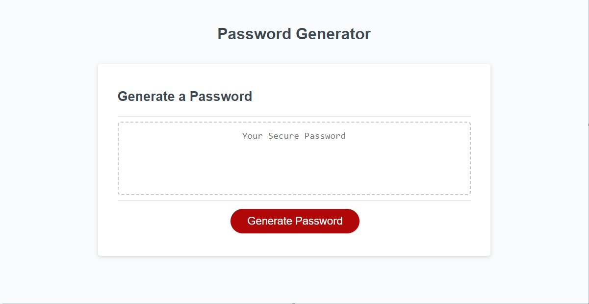

# passwordgenerator-03

Link to deployed application: (https://lukedenhartog.github.io/passwordgenerator-03/)

## In order to achieve a successful random password generator I had to refactor my JavaScript code multiple times.This project provided some hands on practice with JavaScript engineering by adding some functionality to the button

If anyone would like to work on/add to this project it is recommended to first follow these steps:

- Download Visual Studio Code: <https://code.visualstudio.com/>

- Pull the files frop my GitHub Profile Repository: <https://github.com/lukedenhartog/passwordgenerator-03>

- It is recommended to have to latest version of Google Chrome which can be found here: <https://www.google.com/chrome/>.

## Usage

 This (<https://lukedenhartog.github.io/passwordgenerator-03/>) project displays a web based program that asks the user what kind of characters they would like to include and creates a random password generated via JavaScript functions/loops. This module will also be added to a github to display my experience to future visitors to my github page.

If any users have any questions about how to start the project they can reach me at <lukeadenhartog@gmail.com>.

## Credits

The HTML and CSS file were already provided from UCI/edX Coding Bootcamp resources. The JavaScript was sourced from/by Luke A DenHartog.

## License

N/A

## Copyright (c) 2023 Luke

Permission is hereby granted, free of charge, to any person obtaining a copy of this software and associated documentation files (the "Software"), to deal in the Software without restriction, including without limitation the rights to use, copy, modify, merge, publish, distribute, sublicense, and/or sell copies of the Software, and to permit persons to whom the Software is furnished to do so, subject to the following conditions:

The above copyright notice and this permission notice shall be included in all copies or substantial portions of the Software.

THE SOFTWARE IS PROVIDED "AS IS", WITHOUT WARRANTY OF ANY KIND, EXPRESS OR IMPLIED, INCLUDING BUT NOT LIMITED TO THE WARRANTIES OF MERCHANTABILITY, FITNESS FOR A PARTICULAR PURPOSE AND NONINFRINGEMENT. IN NO EVENT SHALL THE AUTHORS OR COPYRIGHT HOLDERS BE LIABLE FOR ANY CLAIM, DAMAGES OR OTHER LIABILITY, WHETHER IN AN ACTION OF CONTRACT, TORT OR OTHERWISE, ARISING FROM, OUT OF OR IN CONNECTION WITH THE SOFTWARE OR THE USE OR OTHER DEALINGS IN THE SOFTWARE.
